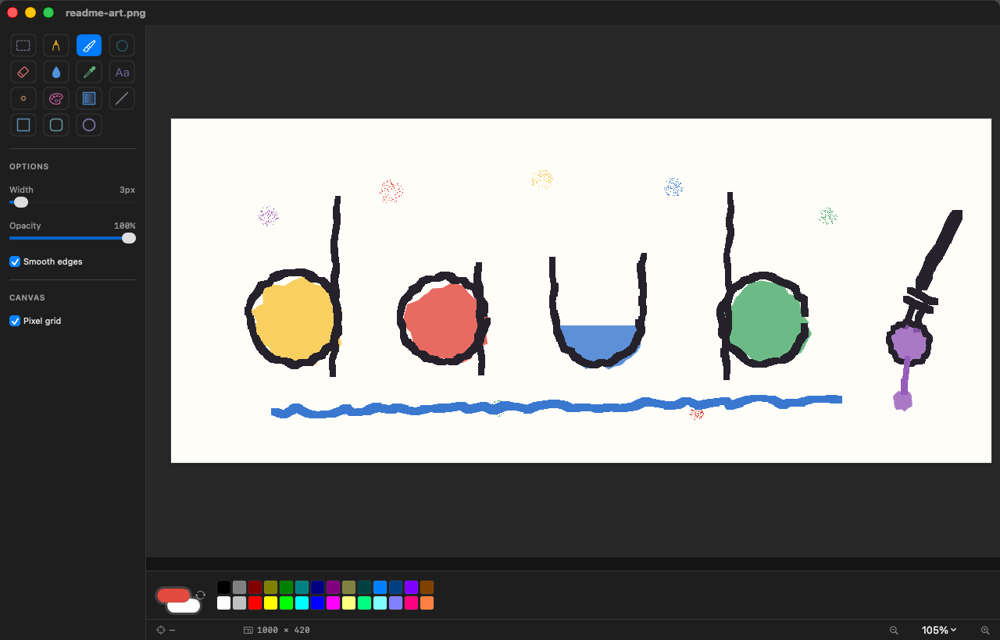
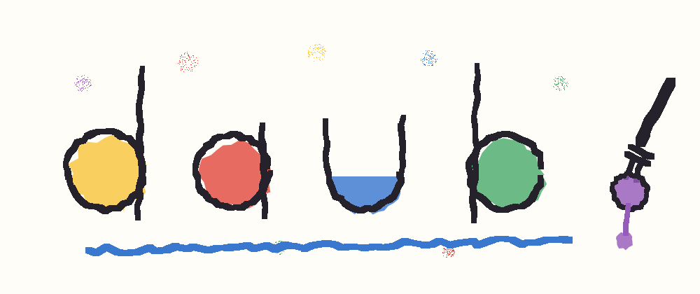

# Daub



A native macOS paint app. Classic-Paint tools, modern finish, no dependencies, ~800 KB.



*Both pictures are made by the app. The drawing is `Scripts/make-readme-art.swift`, which
paints it with `DaubCore` — the same engine the brush and airbrush use: wobbly strokes,
colour laid down before the outline and not quite inside it, and a drip. The screenshot is
Daub rendering its own window into a PNG, with that drawing open. `make readme-art` and
`make screenshot` re-make them.*

macOS ships no raster paint app — Preview's Markup annotates, Freeform is vector, and the
free simple option (Paintbrush) has been unmaintained for years. Daub fills that gap:
open an image, draw on it, save it.

---

## Install

```sh
git clone <this repo> daub && cd daub
make install          # builds, installs to /Applications, clears quarantine flags
open /Applications/Daub.app
```

`make install` is the whole story. It needs the Swift toolchain (Xcode or Command Line
Tools) and nothing else — no Xcode project, no package manager, no signing certificate.

| Command | What it does |
|---|---|
| `make` | Build `build/Daub.app` |
| `make run` | Build and launch it |
| `make install` | Build and install into `/Applications` |
| `make install DESTDIR=~/Applications` | Install somewhere else |
| `make test` | Run the engine tests (no GUI needed) |
| `make uninstall` | Remove the installed copy |
| `make clean` | Delete build artefacts |

**If macOS refuses to open it:** Daub is ad-hoc signed, not notarized, so a copy that
arrives over a share or a download carries a quarantine flag. `make install` clears it. For
a bundle you copied by hand:

```sh
xattr -cr /Applications/Daub.app     # -cr, not -dr: -dr stops at the first file without the flag
```

---

## A five-minute tour

**Draw something.** Daub opens on a white 1024×768 canvas with the pencil selected. Drag to
draw in the foreground colour; **drag with the right button to draw in the background
colour** — that second one is the habit from classic Paint that people miss most.

**Pick colours.** Click a swatch in the bottom strip for the foreground, ⌥-click (or
right-click → *Set as Background*) for the background. The two overlapping wells on the
left open the full colour picker. `X` swaps them.

**Undo is 32 steps deep** (⌘Z / ⇧⌘Z) and covers everything — strokes, shapes, text, fills,
rotations, canvas resizes.

**Save** with ⌘S. PNG, JPEG or TIFF, decided by the extension you type.

---

## The tools

Each has a bare-letter shortcut — no modifier, just the letter, and it never steals a
keystroke from the text tool.

| | Tool | Key | Notes |
|---|---|---|---|
| ✎ | **Pencil** | `P` | One hard pixel, no anti-aliasing, ever. Size 1–16 px. This is the tool for pixel work. |
| 🖌 | **Brush** | `B` | Smooth round stroke, 1–48 px, with an opacity slider. |
| ✳ | **Airbrush** | `A` | Sprays while you hold still, 30 puffs a second. Radius and flow. |
| ⌫ | **Eraser** | `E` | Paints the background colour — or rubs through to transparency on a canvas that has alpha (see below). |
| 💧 | **Fill** | `F` | Flood fill with a tolerance slider for anti-aliased or JPEG-noisy edges. |
| 💉 | **Pick Colour** | `I` | Click to sample; snaps back to the tool you were using. Right-click samples into the background. |
| T | **Text** | `T` | Click, type, press ⏎ to bake it in. Escape cancels. Font and size in the sidebar. |
| ⧉ | **Clone Stamp** | `K` | ⌥-click sets the source, then drag to paint from it. Copies the picture as it was at the start of the stroke, so crossing your own source never smears. |
| 🎨 | **Replace Colour** | `G` | Click a colour: every pixel of it becomes the foreground colour (right-click: the background colour). Tolerance widens the match; a selection limits where it applies. See *Swapping one colour for another*. |
| ▨ | **Gradient** | `Y` | Drag to set direction and length: foreground → background. Clipped to the selection if there is one. |
| ╱ | **Line** | `L` | ⇧ constrains to 45°. |
| ▭ | **Rectangle** | `R` | ⇧ makes it square. |
| ▢ | **Rounded Rectangle** | `D` | |
| ◯ | **Ellipse** | `C` | ⇧ makes it a circle. |
| ⬚ | **Select** | `S` | Rectangular marquee — see below. |

Shape tools have a three-way style picker: **outline · filled · filled with outline**.
Outline uses the dragging button's colour; the fill uses the other one.

### Keys worth knowing

| Key | Does |
|---|---|
| `X` | Swap foreground and background |
| `[` `]` | Shrink / grow the current tool |
| ⇧ + drag | Constrain lines to 45°, rectangles to squares, ellipses to circles |
| Right-drag | Paint with the background colour, any tool |
| ⌘R | Canvas Size… |
| ⌘0 / ⌘1 | Fit in window / actual size |
| ⌘+ / ⌘− | Zoom in / out (or pinch on a trackpad) |
| ⌘⇧K | Crop to selection |
| ⌫ | Clear the selection to the background colour |
| ⌥ + drag | Duplicate a selection instead of moving it |
| ⌘? | Open the in-app help (tools, keys and recipes, with a search field) |
| Escape | Drop the selection (or cancel a move in progress) |

---

## Working with selections

1. Pick **Select** (`S`) and drag a rectangle. Marching ants mark it.
2. **Drag inside it to move it.** The pixels lift out, leaving the background colour behind.
   Hold ⌥ as you start the drag to leave the original where it was and move a copy.
   Arrow keys nudge by 1 px, ⇧+arrows by 10.
3. ⌘C / ⌘X / ⌘V copy, cut and paste. A paste arrives as a floating selection at the top
   left, already selected, so you can drag it into place.
4. The move is committed when you switch tools, deselect, press Escape, or save — all in
   one undo step, so ⌘Z puts the pixels back where they started.
5. ⌘⇧K crops the whole canvas to the selection.

Selections are rectangular. A magic wand or lasso needs a mask-based selection model, which
is a real piece of work rather than an afternoon — see *What's deliberately missing*.

---

## Transparency, and saving a PNG with a transparent background

The canvas is opaque by default, exactly like Paint. Two ways to get alpha:

**Start transparent.** ⇧⌘N — *File → New with Transparent Background*. The canvas shows a
checkerboard, the eraser rubs through to nothing, and ⌘S to `.png` keeps the holes.

**Knock out a background you already have.** Open the picture, then:

1. Set the **background well** to the colour you want gone — the eyedropper (`I`) with a
   **right-click** samples straight into it.
2. Raise **Fill → Tolerance** if the edges are soft or the file is a JPEG (try 20–40).
3. *Image → Make Background Colour Transparent*.

Everything within tolerance of that colour disappears across the whole picture, the
checkerboard appears, and saving as PNG keeps it. Daub tells you if nothing matched rather
than silently doing nothing.

> Saving a transparent canvas as **JPEG** flattens it onto white first — JPEG has no alpha,
> and writing one straight out would turn every hole black.

---

## Swapping one colour for another

**Replace Colour** (`G`) is a whole-area operation, not a brush: you click one pixel and
every pixel that matches it changes at once.

- The **foreground** colour is what you get; right-click to swap to the **background**
  colour instead.
- **Tolerance** widens the match. Flat art needs 0. Anything that has been through JPEG, or
  any anti-aliased drawing, needs 15–40 or you will leave a fringe of near-misses behind.
- **Draw a selection first** and only that area changes — the way to recolour one button
  without touching every other pixel of that colour in the picture. Clicking outside the
  selection does nothing (and beeps); ⌘D deselects.
- **Soft edges stay soft.** A pixel that is half-covered keeps its coverage and only changes
  hue, so a swap does not turn a smooth edge into a stair-step.
- **Empty is not a colour.** On a canvas with transparency, clicking the empty area matches
  the empty area only — never the paint sitting on it — and fills it with the new colour.
  The reverse of that is *Image ▸ Make Background Colour Transparent*, which is the same
  operation with "nothing" as the replacement.
- A click that changes no pixels costs no undo step.

---

## The Image menu

| Item | Notes |
|---|---|
| **Canvas Size…** (⌘R) | Crop or extend, anchored top-left, padding in the background colour — or tick *Scale the picture to fit* to resample instead. |
| **Crop to Selection** (⌘⇧K) | |
| **Make Background Colour Transparent** | Above. |
| **Flip Horizontal / Vertical** | |
| **Rotate Left / Right** | |
| **Invert Colours** (⌘I) | |
| **Clear Image** (⌘⌫) | Fills with the background colour, or empties the canvas if it holds alpha. |

---

## Zoom and the pixel grid

Zoom runs 25% – 3200%, by ⌘+/⌘−, the menu in the status bar, pinch on a trackpad, or ⌘0
to fit the window. From **800%** a faint pixel grid appears — toggle it in the sidebar or
under View. The status bar shows the pointer's pixel coordinate (top-left origin, like every
other image tool), the canvas size, and the selection size while you drag one.

---

## Help, inside the app

**Help ▸ Daub Help** (⌘?) opens a panel with every tool, every key and the recipes above,
with a search field across the lot — type "transparent" or "clone" rather than hunting
sections. The tool list is generated from the same values the toolbox uses, so it cannot
drift out of date. It closes with the drawing.

---

## Worked examples

**Touch a blemish out of a photo**
Open it → **Clone Stamp** (`K`) → set Width to about twice the blemish → ⌥-click a clean
patch nearby → drag over the blemish. Turn *Smooth edges* on so the patch blends.

**Make a logo's white background transparent**
Open it → eyedropper (`I`) **right-click** on the white → *Image → Make Background Colour
Transparent* → if a white fringe survives, ⌘Z, raise Fill Tolerance to ~30, try again →
⌘S as `logo.png`.

**Recolour something**
Select the area first if only part of the picture should change. Then **Replace Colour**
(`G`), Tolerance ~20, foreground set to the new colour, click the old
colour. Every pixel of it in the picture changes at once.

**A quick title card**
⇧⌘N for a transparent canvas → **Gradient** (`Y`), drag top-to-bottom → **Text** (`T`),
size 72, click, type, ⏎ → ⌘S as PNG.

**Pixel art**
⌘R to set a small canvas (say 64×64) → ⌘0 to fit → **Pencil** at size 1 → the grid appears
past 800% and every dab is exactly one pixel.

---

## What "Smooth edges" actually does

It anti-aliases the tools that go through CoreGraphics — brush, clone stamp, and the four
shape tools. It is most visible on a **diagonal** at a width of 1–3 px, or zoomed past 400%:
off gives you hard stair-steps, on gives you grey in-between pixels.

It does nothing at all for the pencil, eraser, airbrush, fill or text, which are
pixel-exact by design — so the checkbox is hidden for those rather than shown having no
effect.

---

## How it's built

| Path | What it is |
|---|---|
| `Sources/DaubCore/` | The engine — no AppKit, no UI, fully testable: `Bitmap`, `FloodFill`, `Raster`, `Shapes`, `UndoHistory`. |
| `Sources/Daub/Model/` | `Editor` (everything the chrome binds to), `PaintDocument` (pixels + history), `Tool`. |
| `Sources/Daub/Views/` | `CanvasView` (the NSView doing all tool work), SwiftUI toolbox, palette, status bar. |
| `Sources/Daub/IO/` | ImageIO reading and writing, and the pasteboard. |
| `Scripts/build-app.sh` | Assembles the `.app` from the SwiftPM build. |
| `Scripts/install.sh` | The above, plus install and un-quarantine. |

### Three decisions worth knowing

**One coordinate space.** A `CGBitmapContext` stores row 0 as the *top* of the picture but
draws with the origin at the *bottom* left. The raster tools address memory; the brush and
shapes go through CoreGraphics. `Bitmap`'s accessors flip on the way to memory so both
speak drawing coordinates — without that, a pencil stroke lands mirrored against an
identical brush stroke. `CoordinateSpaceTests` pins it.

**SwiftUI never hears about a stroke.** `CanvasView` redraws itself and mutates
`PaintDocument` directly; the chrome refreshes only at commit boundaries via
`Editor.didCommit()`. Pointer position lives on a separate `CursorReadout` object so a
mouse-move doesn't re-render the window. The screen draw reads *through* the bitmap's
buffer (`liveImage`) and blits only the dirty region, rather than copying the canvas each
frame.

**Snapshot undo.** 32 full-canvas snapshots, taken before each mutation. Crude, but it
survives every tool without per-tool inverse logic. The cap is a step count, not a byte
budget — 32 steps of a 4096² canvas is about 2 GB.

---

## Reviewed

A three-seat external panel (OpenAI / xAI / Google, reading the code) went over the first
two commits. Fixed from it: the screen redraw copied the whole canvas every frame; "Rotate
Right" turned the picture left; pasting a transparent PNG punched holes in an opaque
canvas; a save landing mid-airbrush cleared the dirty flag while the spray timer still
painted; the unsaved-work alert ran after the window had already closed; cancelling
New/Open still committed a floating selection; a fill that changed nothing still cost an
undo step; the text tool baked its string at the field's frame origin rather than where the
cell drew it; and opening a malformed image could trap on a huge allocation. One panel
claim — that the pixel grid double-scales — was wrong: the grid draws after
`restoreGState`, unscaled.

---

## What's deliberately missing

**Layers.** The single biggest absence. Everything here assumes one bitmap.

**Mask-based selection** — magic wand, lasso, "select by colour". The selection is a
rectangle; making it a mask touches lift, move, paste, crop and every clip in the app.
It is the right next feature, and it is not a small one.

**Also absent:** smudge, blur and sharpen brushes; the curve and polygon tools; free
rotate and scale of a selection; levels and curves adjustments; brush shapes beyond round
and square; multi-line text boxes (the text tool is a single line); multiple windows and
documents; document icons for file types.
